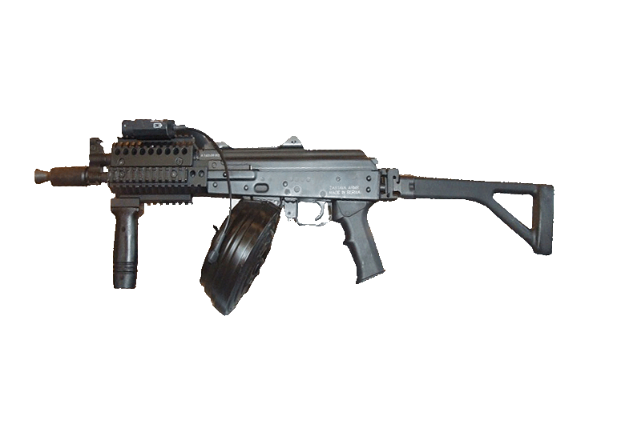

# SnypeYou 

A game about snyping with a gun from atop a building 



## Why

This is a project to learn the Rust programming language and the [Piston game engine](http://www.piston.rs/) as well as teach Severin and Kivik about programming.

## Building and running

You need to have Rust/ Cargo installed. Then run
```bash
$ cargo build
```

And run the `snypeyou` binary in `target/debug`.

## Assets

 all assets are free to use and can be found on these amazing platforms:
- [Fonts on fontsquirrel.com](https://www.fontsquirrel.com/)
- [Art on opengameart.org](https://opengameart.org/)
- [Sounds on freesound.org](https://freesound.org/)
